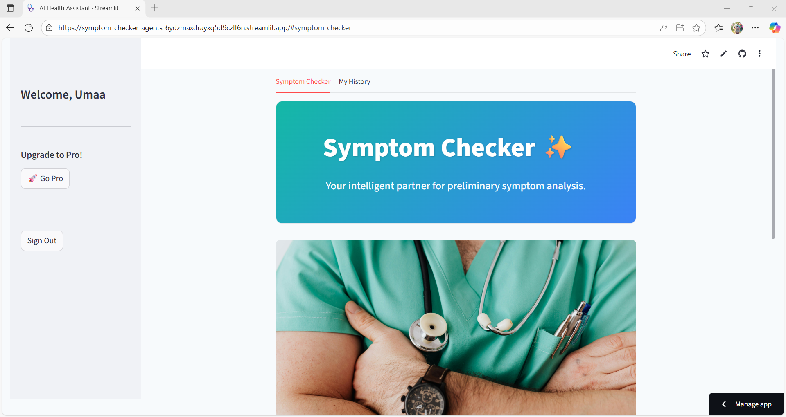
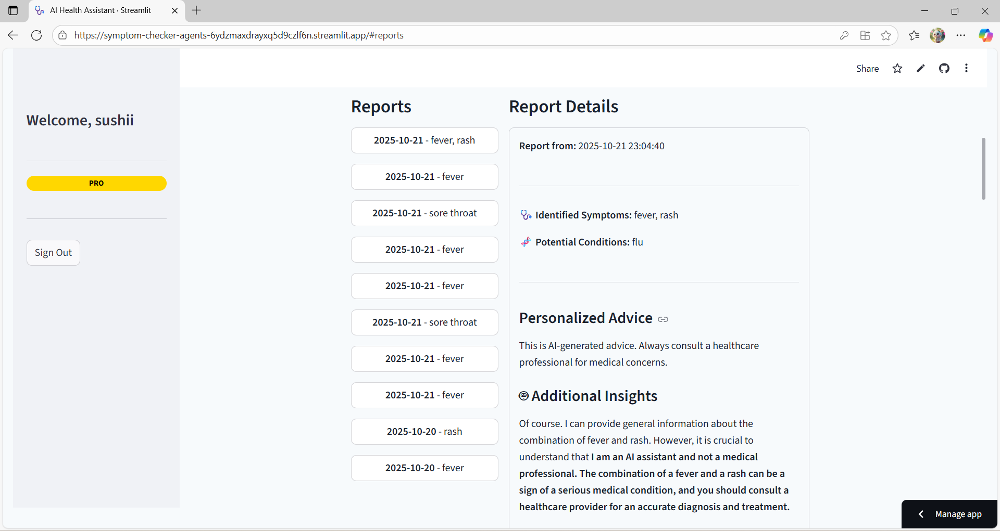
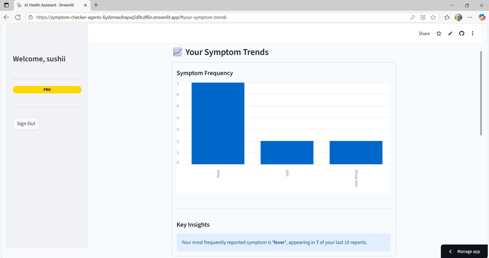
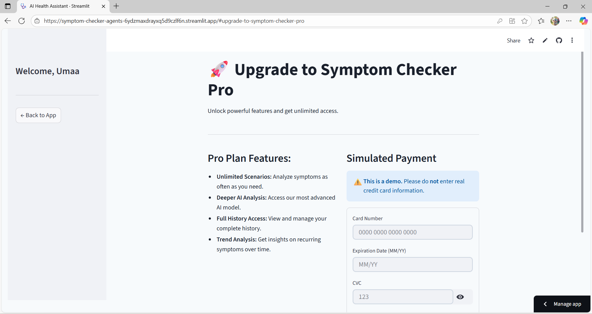

# 🩺 Symptom Checker – Agent-Based Health Assistant

An intelligent, multi-user health assistant that provides AI-powered symptom analysis, saves user history, and offers premium features through a "Pro" plan. This application is built with Python, Streamlit, Google Gemini, and Firebase.

------

## ☁️ Deployment

This application is deployed and publicly accessible via Streamlit Community Cloud.

[Live App Link ](https://symptom-checker-agents-6ydzmaxdrayxq5d9czlf6n.streamlit.app/)
-----


## 📸 Screenshots

Here is a look at the finished application, showcasing the clean UI and Pro features.

| Main Analysis Page | History Page | Trend Analysis (Pro) | Pro page |
| :---: | :---: | :--: | :--: |
|  |  |  |  |


---

## ✨ Features

This is a full-featured web application with a complete user management and monetization system.

### Core Features
* **User Authentication:** Secure sign-up, login, and logout functionality using Firebase Authentication.
* **AI-Powered Analysis:** Users can describe their symptoms in natural language to receive an AI-generated analysis.
* **Persistent History:** Each user's analysis history is saved to a database and can be viewed and deleted at any time.
* **Modern UI:** A clean, professional, and responsive user interface built with custom styling.
* **PDF Export:** Users can download a well-formatted PDF of their health report.

### 💎 Pro Plan Features
* **Usage Limits:** Free users are limited to 10 analyses, creating an incentive to upgrade.
* **Mock Payment Page:** A realistic (but non-functional) payment page with form validation to simulate the upgrade process.
* **Deeper AI Analysis:** Pro users get access to a more powerful Gemini model (`gemini-2.5-pro`) for higher-quality insights.
* **Unlimited History:** Pro users can view their entire analysis history, whereas free users are limited.
* **Trend Analysis:** A Pro-only feature that visualizes a user's symptom frequency over time with a bar chart.
* **PDF Customization:** Pro users can download reports without any application branding in the footer.

---

## 🔧 Tech Stack & Architecture

* **Frontend:** Streamlit
* **Backend & Database:** Python, Firebase (Authentication & Realtime Database)
* **AI Models:** Google Gemini
* **Key Libraries:**
    * `Pyrebase4` (for Firebase connection)
    * `google-generativeai` (for Gemini API)
    * `Pandas` (for charting)
    * `FPDF2` (for PDF generation)

---

## 🚀 How to Run Locally

To get this project running on your local machine, follow these steps.

1. **Create a Virtual Environment:**

    ```bash
    python -m venv venv
    source venv/bin/activate  # On Windows, use `venv\Scripts\activate`
    ```

2.  **Install Dependencies:**

    ```bash
    pip install -r requirements.txt
    ```

3.  **Run the Streamlit App:**

    ```bash
    streamlit run streamlit_app.py
    ```

-----

## 🎯 Project Goals

This project was developed to practice and master several key concepts:

  * Orchestrating a multi-agent system using Crew AI.
  * Building a polished, interactive web application with Streamlit.
  * Integrating multiple components into a cohesive, end-to-end application.
  * Applying modern UI/UX principles to data-driven applications.
